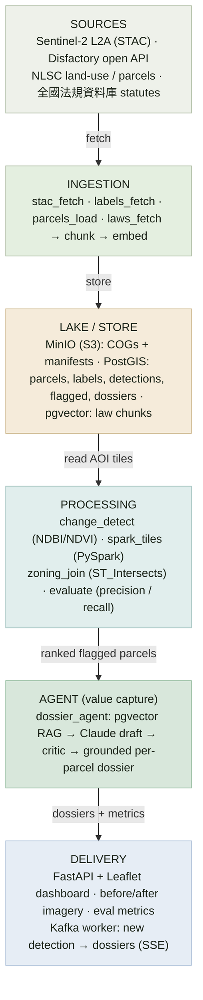

# AgriSentinel

**Automated detection of illegal factories on farmland + AI-generated enforcement dossiers.**

Big Data Systems final project (Spring 2026, NTU). AgriSentinel is a thin,
working, end-to-end pipeline that watches one pilot township in Changhua County
(彰化縣 和美鎮), detects new structures appearing on agricultural land from
Sentinel-2 imagery, confirms they sit on farmland via a PostGIS zoning join, and
uses a Claude agent (RAG over Taiwanese statutes) to draft a per-parcel
**enforcement dossier**, the artifact a county enforcement unit or the
Disfactory NGO actually files.

> The product we sell is the **agent's decision-grade output**, not the raw data
> underneath. The big-data pipeline exists to feed the agent a substrate fresh
> and well-structured enough that its dossier beats anything a generic chatbot
> could produce. The full business + technical case is in
> **[`report/report.pdf`](report/report.pdf)** (Typst source: `report/report.typ`).

- **GitHub:** https://github.com/HaoWen46/AgriSentinel
- **Live demo:** _(optional bonus, add the deployed URL here and on report page 1)_
- **Status:** end-to-end verified against the live stack, a sample run scores
  **precision 0.67 / recall 0.80 / F1 0.73** vs. Disfactory labels (shown on the
  dashboard and printed by `make evaluate`).

---

## Architecture



| Layer | Technology | Why it earns its place |
|---|---|---|
| Imagery | Sentinel-2 L2A via **Planetary Computer STAC** | Free, no-auth, time-series enables change detection; COG windowed reads keep volume tractable |
| Raw lake | **MinIO** (S3) + Cloud-Optimized GeoTIFF | Variety + volume: immutable raster zone, lakehouse pattern |
| Batch | **PySpark** tiles the AOI, maps CD per tile | Batch paradigm: reprocess many tiles / historical dates |
| Spatial + vector store | **PostGIS + pgvector** | Spatial joins (是否農地) and statute RAG in one store |
| Stream | **Apache Kafka** (KRaft; Redpanda-compatible Kafka API) | Velocity: new-detection events fan out to a worker + the dashboard |
| Agent | **Anthropic Claude** (`claude-opus-4-8`) | The cognitive worker producing the sold artifact |
| Delivery | **FastAPI + Leaflet** | Map dashboard + dossier download + metrics |
| Orchestration | **docker compose** + `Makefile` | One-command local run for graders |

---

## Quick start (Docker, recommended)

**Prerequisites:** Docker (with Compose) and, for LLM-authored dossiers, an
Anthropic API key. Everything else is bundled.

```bash
cp .env.example .env          # then set ANTHROPIC_API_KEY in .env (optional)
make demo                     # build + up + live ingest + detect/join/evaluate/dossiers
# open http://localhost:8000
```

No network / no API key? Run the fully offline demo (deterministic synthetic
imagery + sample labels; rule-based template dossiers):

```bash
make demo-offline
# open http://localhost:8000
```

The offline demo is deterministic and, by construction, yields a non-trivial
**precision 0.67 / recall 0.80** (some detections have no matching label, and one
labelled factory has no detectable patch), an honest score, not a staged 100%.
The streaming bonus (Phase 6) needs the Kafka broker; the core pipeline and
dashboard work without it.

Useful targets (`make help` lists all):

| Target | What it does |
|---|---|
| `make up` / `make down` | Bring the stack up (waits for health) / stop it |
| `make ingest` | Phase 1: Sentinel-2 + Disfactory labels + parcels + statutes |
| `make seed` | Phase 1 offline: synthetic imagery + sample labels + parcels + statutes |
| `make detect` / `make tile` | Phase 2: change detection (whole-AOI / PySpark-tiled) |
| `make join` / `make evaluate` | Phase 3: zoning join / precision-recall vs Disfactory |
| `make dossiers` | Phase 4: generate enforcement dossiers (needs `ANTHROPIC_API_KEY`) |
| `make pipeline` | Phases 2–4 over current data |
| `make test` / `make lint` | Test suite / ruff (host, via `uv`) |
| `make clean` | Stop and remove volumes (destroys local data) |

The dashboard lets a grader pick a run, read precision/recall, click any flagged
parcel, and see its before/after Sentinel-2 chips + the generated dossier.

---

## Local development (without Docker)

Uses [`uv`](https://docs.astral.sh/uv/). The pipeline stages still need PostGIS,
MinIO and (optionally) Kafka reachable, easiest is to run those via
`docker compose up -d minio postgis kafka` and point `.env` at `localhost`.

```bash
uv sync --extra dev          # core + test deps
uv run --extra dev python -m pytest -q
uv run agrisentinel --help   # init-db, ingest-stac, detect, join, evaluate, dossiers, serve, seed
```

Optional capability extras (the pipeline runs without them via documented
fallbacks): `--extra ml` (torchgeo deep CD, transformer embeddings),
`--extra spark` (PySpark), `--extra demand` (the Component-2 scripts).

---

## Demand evidence (Component 2, reproducible)

```bash
uv run --extra demand python scripts/demand/disfactory_stats.py   # reports/year near the AOI
uv run --extra demand python scripts/demand/tender_search.py      # gov procurement (WTP) matches
# scripts/demand/survey_questions.md, the exact survey instrument
```

Outputs land in `outputs/demand/` (JSON + CSV + chart). See `report/report.pdf`
§2 (Demand) for the analysis, a representative run finds **100 Disfactory
reports** near the pilot township and **370 government tenders** matching
monitoring / remote-sensing keywords.

---

## Configuration & the "no hardcoding" rule

Nothing in this repo hardcodes a machine path, host, or secret. Behaviour is
driven entirely by:

- **`.env`** (gitignored), `ANTHROPIC_API_KEY`, service URLs, model, embedder,
  detector. Template in `.env.example`.
- **`config/aoi_changhua.yaml`**, the pilot bbox, scene dates, thresholds, the
  parcel provider, and the statute PCodes. Change this one file to re-target
  another township. `DATA_DIR` defaults to a relative `./data`.

## Data sources & licences

- **Sentinel-2** © ESA / Copernicus (open).
- **Disfactory** reported factories © 農地違章工廠回報系統貢獻者, CC BY 4.0.
- **Statutes** © 全國法規資料庫 (Ministry of Justice) open data, curated
  excerpts under `data/laws_seed/`, each citing its source URL.
- **NLSC** land-use / cadastral, full vector cadastre requires a
  government/academic application (see report §GTM); the demo defaults to a
  deterministic synthetic parcel layer clearly labelled `source='synthetic'`.
- **Government tenders**, 政府電子採購網, public record (via the g0v PCC API).

Dossiers are **decision-support, not legal determinations**; the artifact targets
parcels/structures, not persons (PDPA-aware).

## Repository layout

```
agrisentinel/  shared utils (config, db, storage, geo, raster, embeddings, seed, cli)
ingestion/     stac_fetch · labels_fetch · parcels_load · laws_fetch
processing/    change_detect · spark_tiles · zoning_join · evaluate
agent/         dossier_agent + prompts/
api/           main (FastAPI) · stream (Kafka worker + SSE)
dashboard/     index.html (Leaflet)
scripts/       init_db.sql · demand/ (reproducible evidence)
data/laws_seed/ curated statute corpus (committed)
report/        report.typ → report.pdf (deliverable); report.md (markdown mirror)
tests/         unit + DB-integration tests
```

## Tests

```bash
make test     # 14 tests: pure-logic units + a PostGIS zoning-join correctness
              # integration test (auto-skips when no database is reachable)
make lint     # ruff
```
